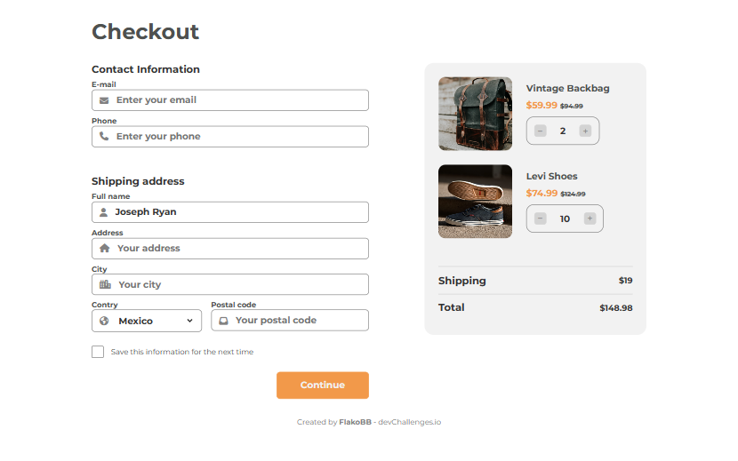

<h1 align="center">Checkout Page</h1>

   Solution for a challenge from  <a href="http://devchallenges.io" target="_blank">Devchallenges.io</a>.

  <h3>
    <a href="https://flakobb.github.io/checkout-page/">
      Demo
    </a>
     | 
    <a href="https://github.com/FlakoBB/checkout-page">
      Solution
    </a>
     | 
    <a href="https://devchallenges.io/challenges/0J1NxxGhOUYVqihwegfO">
      Challenge
    </a>
  </h3>

<!-- TABLE OF CONTENTS -->

## Table of Contents

- [Overview](#overview)
  - [Built With](#built-with)
- [Features](#features)
- [Contact](#contact)

<!-- OVERVIEW -->

## Overview

This is a page with a form structured in HTML and styled in CSS. It has a validation that, when successful, shows a green toast; when invalidated the toast will be red. The validation is programmed in JS with basic functions and methods.

The repository is published on github and deploy on github pages.

### Built With

- HTML
- CSS
- JavaScript

## Features

This application/site was created as a submission to a [DevChallenges](https://devchallenges.io/challenges) challenge. The [challenge](https://devchallenges.io/challenges/0J1NxxGhOUYVqihwegfO) was to build an application to complete the given user stories.

the icons used are from [Font Awesome](https://fontawesome.com/)

## Contact

- Redes [Follow me](https://bit.ly/follow-flako)

---
